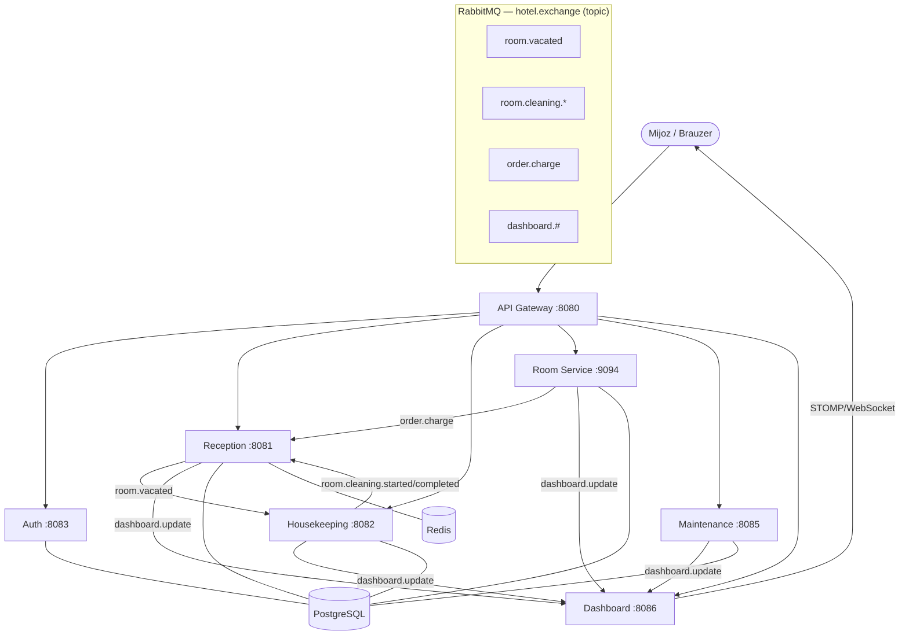

# HotelOS — Mehmonxonani boshqarish mikroservis tizimi

**Muallif:** Xudoyyor Davronov (240240)
**Modul:** Programming (BTEC)

HotelOS — bu zamonaviy mehmonxonaning kundalik operatsiyalarini (qabul, hisob-kitob, xonalarni tozalash, texnik xizmat, xona xizmati va jonli monitoring) boshqarish uchun mo'ljallangan **mikroservislarga asoslangan** tizim. Tizim **Spring Boot**, **PostgreSQL**, **RabbitMQ** va **Redis** texnologiyalari ustiga qurilgan.

---

## 1. Arxitektura

Tizim 7 ta mustaqil servisdan iborat bo'lib, ular bitta API Gateway orqali tashqi dunyoga ochiladi va o'zaro **hodisaga asoslangan** (event-driven) usulda RabbitMQ orqali muloqot qiladi.



### Servislar va portlar

| Servis | Port | Vazifasi | Ma'lumotlar bazasi |
|---|---|---|---|
| `gateway-service` | 8080 | Yagona kirish nuqtasi, JWT tekshiruvi, marshrutlash | — (Redis) |
| `auth-service` | 8083 | Ro'yxatdan o'tish, login, JWT token berish | `auth_db` |
| `reception-service` | 8081 | Mehmon, bron, check-in/out, hisob-kitob | `reception_db` (+Redis) |
| `housekeeping-service` | 8082 | Xonalarni tozalash navbati va holati | `housekeeping_db` |
| `room-service` | 9094 | Xonaga taom/ichimlik buyurtmasi (oshxona navbati) | `room_db` |
| `maintenance-service` | 8085 | Texnik nosozliklar (ustuvorlik navbati) | `maintenance_db` |
| `dashboard-service` | 8086 | Jonli operatsiyalar paneli (WebSocket) | — (xotirada holat) |

---

## 2. Texnologiyalar

- **Java 21** (dashboard — Java 17), **Spring Boot 3.x / 4.x**
- **Spring Web**, **Spring Data JPA**, **Spring Security**, **Bean Validation**
- **PostgreSQL 15** — har bir servis uchun alohida baza (Database-per-Service)
- **RabbitMQ 3** — yagona `hotel.exchange` (topic) orqali asinxron muloqot
- **Redis 7** — reception/gateway uchun kesh va sessiya
- **JWT (jjwt)** — stateless autentifikatsiya
- **WebSocket + STOMP (SockJS)** — jonli dashboard
- **springdoc-openapi (Swagger UI)** — har bir servis API hujjati
- **Docker & Docker Compose** — to'liq orkestratsiya
- **Gradle**, **Lombok**

---

## 3. Dasturlash paradigmalari (assignmentga muvofiqlik)

| Paradigma | Tizimdagi namunasi |
|---|---|
| **OOP — inkapsulyatsiya** | Barcha JPA entity'lar (`Room`, `Booking`, `Guest`, `Order`, `Task`...) maydonlari `private`, kirish faqat metodlar orqali. |
| **OOP — meros (inheritance)** | `auth-service/domain`: abstrakt `Employee` → `Receptionist`, `Cleaner`, `Technician`, `Administrator`. |
| **OOP — polimorfizm** | `Employee.describeAccess()` har bir avlodda turlicha ishlaydi; `EmployeeFactory` mos turdagi obyektni yaratadi (Factory pattern). |
| **OOP — abstraksiya** | Reception `ReceptionService` interfeysi + `ReceptionServiceImpl` realizatsiyasi. |
| **Hodisaga asoslangan (event-driven)** | RabbitMQ publisher/subscriber: `room.vacated`, `room.cleaning.*`, `order.charge`, `dashboard.update`. |
| **Ma'lumot tuzilmalari** | `KitchenQueue` — FIFO `LinkedList` (oshxona); Maintenance — `PriorityQueue` (ustuvorlik bo'yicha). |
| **Funksional / Stream API** | Bo'sh xonalarni tanlash, hisob-kitobni jamlash `stream()`/`filter()`/`reduce()` orqali. |
| **Validatsiya va xatoliklarni boshqarish** | `@Valid` + `jakarta.validation`, har bir servisda `@ControllerAdvice` GlobalExceptionHandler. |

---

## 4. Asosiy biznes-jarayonlari (event flow)

1. **Check-out → tozalash:** Reception check-out qiladi → xona `IFLOS` → `room.vacated` nashr etiladi → Housekeeping tozalash vazifasini `NAVBATDA` holatida yaratadi.
2. **Tozalash → sinxronizatsiya:** Housekeeping tozalashni boshlaydi/tugatadi → `room.cleaning.started` / `room.cleaning.completed` → Reception xona holatini `TOZALANMOQDA` / `TOZA` ga yangilaydi (`lastCleanedAt` rotatsiya uchun).
3. **Xona xizmati → hisob:** Room-service buyurtmani yetkazadi → `order.charge` → Reception to'lovni mehmonning faol bronига `BillingItem` sifatida qo'shadi.
4. **Jonli panel:** Har bir servis muhim o'zgarishda `dashboard.update` nashr etadi → Dashboard holatni yangilab, WebSocket orqali brauzerga jo'natadi (`/topic/updates`).

> **Maxfiylik:** Dashboard hodisalarida pasport raqami yoki to'liq karta ma'lumotlari **hech qachon** uzatilmaydi.

---

## 5. Ishga tushirish

### Talablar
- Docker va Docker Compose

### Buyruq
```bash
docker compose up --build
```

Bu buyruq PostgreSQL, RabbitMQ, Redis hamda barcha 7 ta servisni ko'taradi. PostgreSQL birinchi ishga tushganda `init.sql` orqali har bir servis bazasini avtomatik yaratadi.

### Foydali manzillar
| Nima | Manzil |
|---|---|
| API Gateway | http://localhost:8080 |
| Jonli Dashboard | http://localhost:8086/LiveActionPanel.html |
| RabbitMQ paneli | http://localhost:15672 (`hotel_guest` / `hotel_secret`) |
| Swagger (har servis) | http://localhost:PORT/swagger-ui.html |

---

## 6. Loyiha tuzilishi

```
HotelOS/
├── docker-compose.yml      # Butun tizim orkestratsiyasi
├── init.sql                # Servislararo bazalarni yaratish
├── gateway-service/
├── auth-service/
├── reception-service/
├── housekeeping-service/
├── room-service/
├── maintenance-service/
└── dashboard-service/
```

Har bir servis mustaqil Gradle loyihasi bo'lib, o'z `Dockerfile`, `build.gradle` va `application.properties` fayllariga ega.
